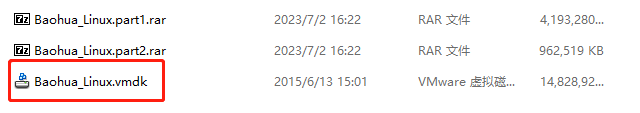
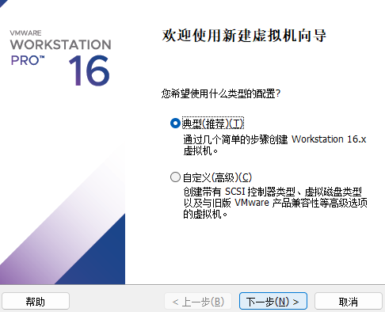
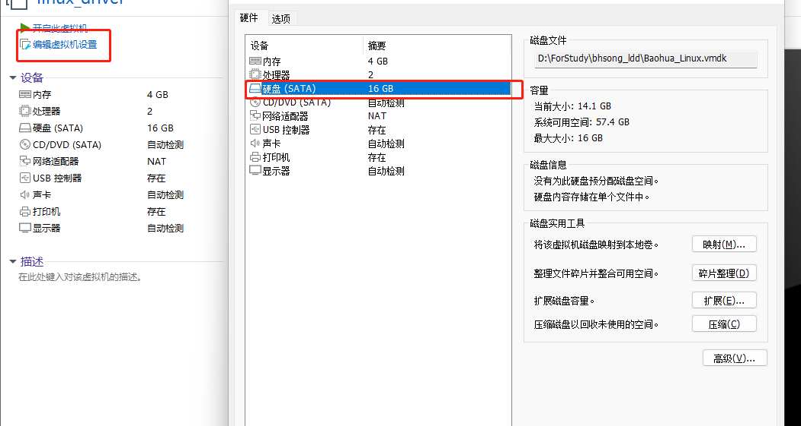
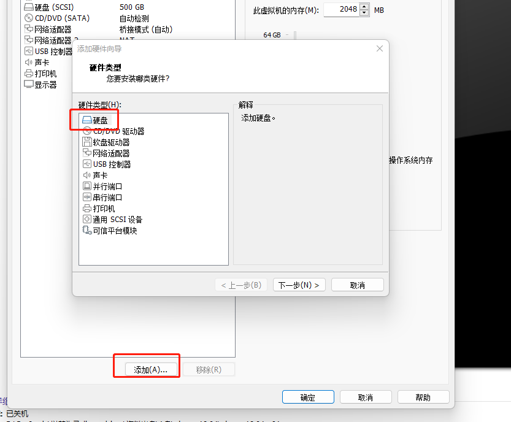
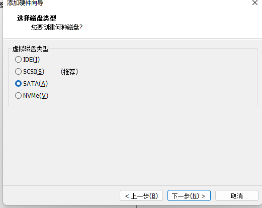
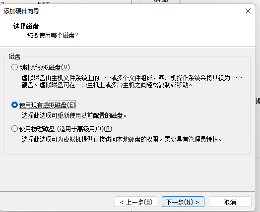
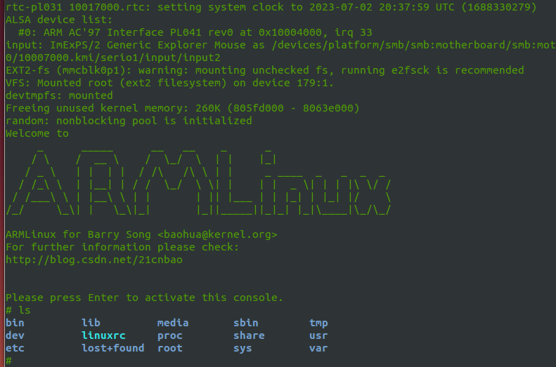

#### 1.虚拟机压缩包路径：
* 链接：https://pan.baidu.com/s/16TxwFurcobb9rqQ2TNscdg 
提取码：13ph
#### 2.解压baohua_linux_part1
 * 解压之后得到下图：（因为是分卷压缩的，所以解压第一个就够了）
 

#### 3. 创建虚拟机
* vmdk文件要选择自己新建虚拟机，然后一直点下一步，到最后完成。期间有个选择地址的需要自己改下）
 
 * 更改磁盘文件，选择更改硬件选型，然后把原来的硬盘删除了（下面的图是我添加的，选择硬盘，然后删除）
    

* 添加vmdx硬盘，即解压出来的虚拟机。其中注意要选择**SATA**的方式，然后自己选择磁盘构建虚拟机。
  
  
  

#### 4. 搭建qemu的平台
* 启动上述虚拟机之后，输入命令：baohua 就可以进入虚拟机了，然后按住ctrl+alt+T 打开terminal窗口，虚拟机已经安装好了编译工具链，并且内核目录在`/home/baohua.develop/linux`的目录下了。
* 只要执行命令
```c
sudo mount -o loop,offset=$((2048*512)) extra/vexpress.img /extra/img
cd extra
./run-nolcd.sh
```

* 目前发现这款虚拟机不能够将内容复制出来，学习十分不便，可以参考下面连接自己编译boot+根文件系统+内核 搭建qemu 的环境。
    * 路径：https://blog.csdn.net/zhvngchvng/article/details/107856401

-----
#### 5.补充。
* 发现虚拟机不能复制出去的问题和不便编辑的问题，都可以通过安装vmware_tool解决，安装完成之后就可以直接拖动文件，以及可以复制代码出虚拟机啦。
* 地址：https://blog.csdn.net/qq_41892825/article/details/122464113
##### 5-2 关于下载的ubuntu14.04 不能联网的问题：
* 执行`lspci | grep Ethernet` 指令，会出现：
```
Ethernet controller: Advanced Micro Devices, Inc. [AMD] 79c970 [PCnet32 LANCE] (rev 10)
```

   * 说明就是没有网卡驱动，这个是以前vmware提供79c970的驱动，然后现在vmware提供了e1000的驱动了，因此需要修改.vmx文件。
  *  1. 关闭虚拟机
  *  2. 在虚拟机的 .vmx文件（在你安装的目录下），最后添加 ethernet0.virtualDev = “e1000” 
  *  3. 重启虚拟机，你就会惊喜的发现网络从全黑的wifi标志编程了传输标志啦！